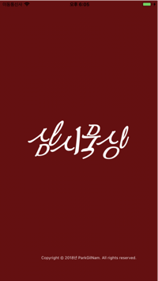
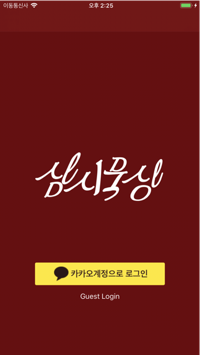
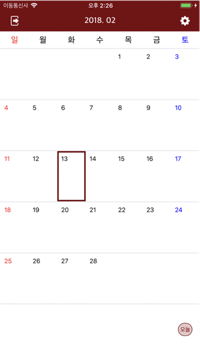
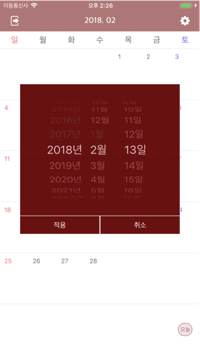
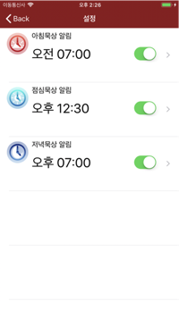
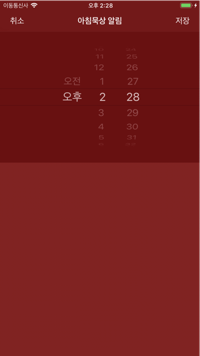
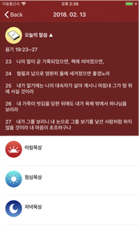
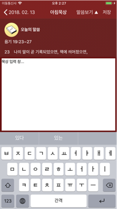

삼시묵상
=======================

## 1. 삼시묵상은...
교회 생활을 하면서 묵상과 관련 된 많은 컨텐츠를 보았지만 하루에 세번 말씀을 묵상할 수 있게 해주는 컨텐츠를 본 적은 없습니다.

하루 세번 밥은 꼬박꼬박 챙겨 먹으면서 그 보다 더 중요한 양식인 말씀은 하루에 한번 그것도 잘 하지 못하는 자신을 보며,
하루에 세번 밥 먹듯이 말씀을 챙겨보면 좀 더 하나님을 느낄 수 있지 않을까 생각하며 만든 어플리케이션입니다.

비록 iOS를 배우며 처음 개발한 어플리케이션이다보니 부족한 부분이 많지만 그 안에 어떻게 하면 사용자들이 
더 쉽고 더 간단하게 어플을 사용할 수 있을까 고심하여 만든 어플리케이션입니다.

## 2. 화면구성
* **LaunchScreen (앱 로딩 화면)**

  

* **로그인 화면**

  앱을 사용하기 전 로그인을 하는 화면
  * 카카오 로그인 : 사용자 구분을 위해 카카오 계정을 사용
  * Guest Login : 앱을 둘러보는 용도
    
  

* **메인 화면**

  앱의 메인화면으로 캘린더 형태로 제작되었으며, 현재 나의 묵상 날짜별 묵상 상태를 확인 할 수 있게 해주는 화면
  * 상단 날짜선택 : 날짜 선택 화면이 팝업 되며, 선택된 년, 월을 표시해줌
  * 설정 : 아침, 점심, 저녁 알림 시간을 설정할 수 있는 설정화면으로 이동
  * 묵상일 클릭 : 묵상일을 클릭하면 선택한 날짜의 말씀 및 자신이 저장한 묵상 내용을 볼 수 있는 오늘의 묵상 화면으로 이동
    
  
  
* **날짜선택**

  메인화면에서 상단 날짜 선택을 클릭하면 나오는 화면으로 선택한 년, 월로 바로 이동 가능하게 해주는 화면
    
  
  
* **설정**

  메인화면에서 설정 아이콘을 클릭하면 나오는 화면으로 아침, 점심, 저녁 알림 시간을 선택하여 각 시간마다 묵상 푸쉬알림을 받을 수 있도록 해주는 화면
  * 셀 클릭 : 시간을 설정할 수 있는 시간 설정 화면으로 이동
  * 알림 on/off : 아침, 점심, 저녁 알림을 on/off 할 수 있도록 하는 버튼
    
  
  
* **알림 시간 설정**
  
  설정화면에서 셀 클릭 시 나타나는 화면으로 알림 시간을 설정
     
  
  
* **오늘의 말씀 및 묵상**
  
  메인화면에서 묵상일을 클릭 했을 때 나타나는 화면으로 해당 일의 말씀 및 자신이 작성한 묵상 내용을 보여주는 화면
  * 오늘의 말씀 : 선택한 묵상일에 묵상 할 말씀이 표시
  * 묵상 셀 클릭 : 아침, 점심, 저녁 묵상 셀을 클릭하면 해당 묵상 내용을 입력 할 수 있는 화면으로 이동
     
  

* **묵상 입력**
  
  오늘의 말씀 및 묵상 화면에서 아침, 점심, 저녁 묵상 셀을 클릭하며 나타나는 화면으로 묵상 내용을 입력하고 저장 할 수 있는 화면
  * 말씀보기 : 해당 일의 말씀을 보여줌
  * 저장 : 입력된 묵상 내용을 서버에 업로드
     
  
  
## 3. 사용된 기술 및 도구
* **개발 언어**
  * Swift 4.0 : App 개발언어
  * Node.js(ubuntu v7.10.1) : Web Server 개발언어
  
* **개발 도구**
  * XCode 9.2 : App 개발 IDE
  * ATOM 1.23.3 : Web Server 개발 IDE
  * AWS(Ubuntu) : Web Server, DB Server 구축
  * MongoDB(ubuntu v3.6.2)
  
* **라이브러리**
  * Kakao SDK(ios-v1.6.0) : App Login 및 사용자 관리를 위한 데이터 사용
  * Mongoose : Node.js와 MongoDB 연동을 위한 Node.js 모듈

* **기타**
  * Sketch : UI 이미지 및 아이콘 디자인
  
## 4. 링크
* [삼시묵상 AppStore 링크](https://itunes.apple.com/kr/app/%EC%82%BC%EC%8B%9C%EB%AC%B5%EC%83%81/id1343039640?mt=8)
* [Server Github 링크](https://github.com/swieeft/Three_meditation_a_day_Server)
* [삼시묵상 블로그 링크](http://three-meditation-a-day.tistory.com/)

> **현재 서비스 종료되었습니다.**
